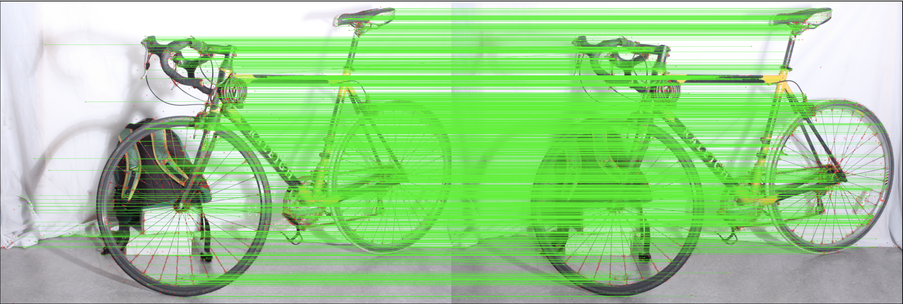
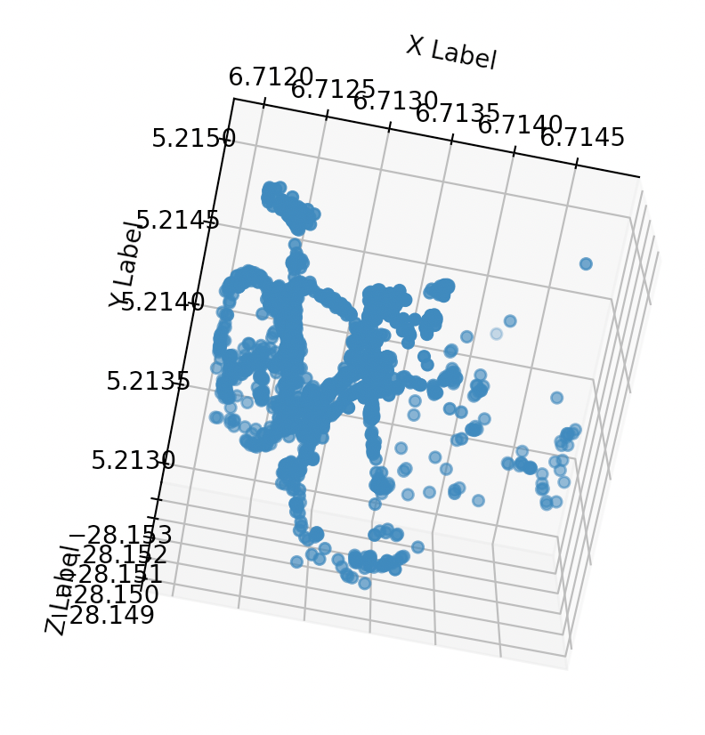

# 3d-reconstruction 

# Introduction

Three dimensional stereo reconstruction is a fundamental technique in computer vision with a wide range of application in fields such as augmented reality, gaming, and animation to mention a few.

(TODO: give a brief overview of epipolar geometry)

# Data

The Computer Vision team at Middleburry College has made benchmark stereo datasets available at their website (https://vision.middlebury.edu/stereo/data/) since 2001. Datasets include image pairs, depth maps, and calibration data.

Note: we have added a few data sets under `test_data/` directory for convenience.

# Environment

Create your envirnoment using `conda` or `virtualenv`. Make sure `which pip` is pointing to the correct path. Then, run

```pip install -r requirements.txt ```


# Script
```python reconstruct.py```

You can find config params in `confs/config.yml`. In order to see point to point matches obtained from applying SIFT, change the display param to `True`.

Consider the following stereo pair of images.

First image


Second image


Matched keypoints are shown below



After performing triangulation, we obtain (note: the image below was a result of a rotation, your output might be different):

